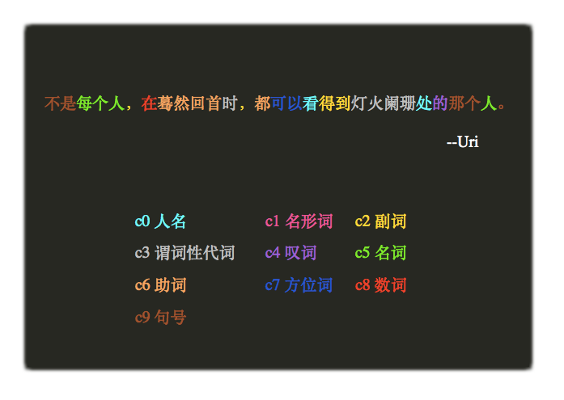
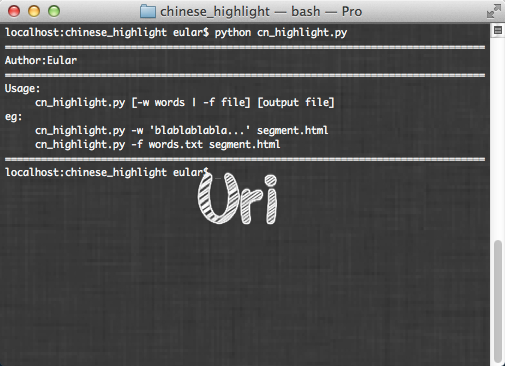

chinese_highlight
=================
中文语法高亮
----------

###Usage:
<pre>
&lt;script type="text/javascript" src="http://paiplace.5gbfree.com/github/cn_highlight.js"&gt;&lt;/script&gt;
&lt;chinese&gt;将要语法高亮的中文放到该标签里即可&lt;/chinese&gt;
</pre>

##cn_highlight.py
###用python写的脚本，结合SAE的分词服务，将中文文本转成语法高亮的html。

